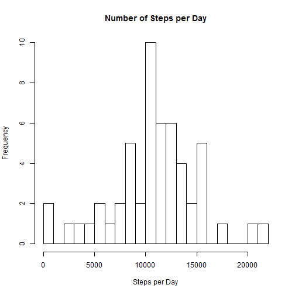
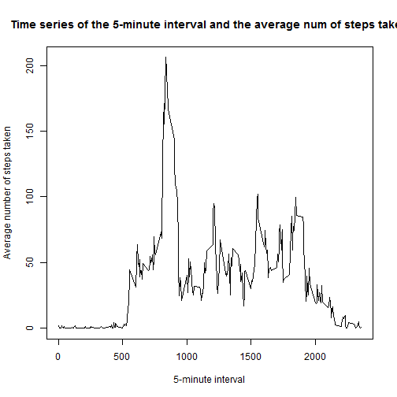
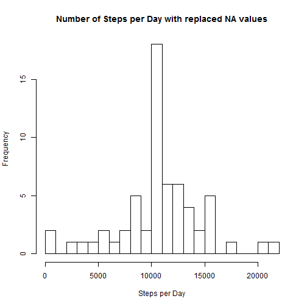
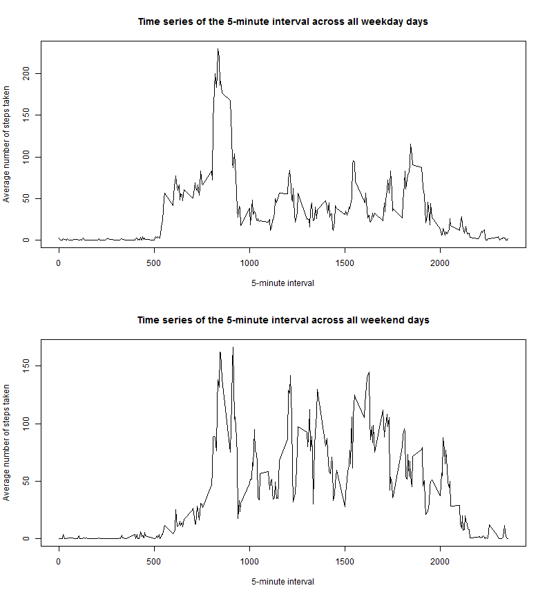

Peer Assessment 1, Reproducible Research
========================================
  
  
##Introduction


In this assignment the personal movement data of an individual recorded over a period of two months will be analyzed.
  
  
  
##Loading and preprocessing the data


Loading the movement data from file


```r
activityData <- read.csv("activity.csv", stringsAsFactors=FALSE)
summary(activityData)
```

```
##      steps            date              interval     
##  Min.   :  0.00   Length:17568       Min.   :   0.0  
##  1st Qu.:  0.00   Class :character   1st Qu.: 588.8  
##  Median :  0.00   Mode  :character   Median :1177.5  
##  Mean   : 37.38                      Mean   :1177.5  
##  3rd Qu.: 12.00                      3rd Qu.:1766.2  
##  Max.   :806.00                      Max.   :2355.0  
##  NA's   :2304
```

```r
# Transforming dates into a valid date-class
actDate <- strptime(activityData$date, "%Y-%m-%d")
activityData$date <- actDate
```


##What is mean total number of steps taken per day?


Calculating the mean total number of steps taken per day and presenting them as a histogram.


```r
numDays <- length(activityData$steps) / 288
stepsPerDay <- vector("numeric")
for (i in 1:numDays) {
    firstIntOfDay <- (288 * (i-1)) + 1
    lastIntOfDay <- 288 * i
    if(!is.na(activityData$steps[firstIntOfDay])) {
        numSteps <- sum(activityData$steps[firstIntOfDay:lastIntOfDay])
        stepsPerDay <- c(stepsPerDay, numSteps)
    }
}

hist(stepsPerDay, breaks = 20, main = "Number of Steps per Day", xlab = "Steps per Day")
```

 

```r
meanStepsPerDay <- format(mean(stepsPerDay), digits = 6)
medianStepsPerDay <- format(median(stepsPerDay), digits = 6)
```


The mean of steps per day is 10766.2 .   
The median of steps per day is 10765 .  


##What is the average daily activity pattern?


Constructing a time series plot of the 5-minute interval and the average number of steps taken, which are averaged across all days.

```r
avgSteps <- aggregate(activityData$steps ~ activityData$interval, activityData, mean)
colnames(avgSteps)[1:2] = c("interval","steps")
plot(x = avgSteps$interval, y = avgSteps$steps, type="l", xlab = "5-minute interval", ylab = "Average number of steps taken", main = "Time series of the 5-minute interval and the average num of steps taken")
```

 

```r
# 5-minute interval with highest number of steps on average
avgSteps[avgSteps$steps == max(avgSteps$steps), 1]
```

```
## [1] 835
```

The 5-minute interval with the highest number of steps on average is 835.


##Imputing missing values


```r
numNAValues <- length(activityData$steps[is.na(activityData$steps)])
```

The total number of NA values in the data set is 2304.

The Replacement Strategy chosen is to replace the NA values with the average total steps per 5-minute interval.


```r
cleanedActivityData <- activityData
for (i in 1:length(cleanedActivityData$steps)) {
    if (is.na(cleanedActivityData$steps[i])) {
        iAvg <- i %% 288
        if(iAvg == 0) iAvg <- 288
        cleanedActivityData$steps[i] <- avgSteps$steps[iAvg]
    }
}
```

Calculating the mean total number of steps taken per day without NA values.


```r
numDays <- length(cleanedActivityData$steps) / 288
stepsnoNAPerDay <- vector("numeric")
for (i in 1:numDays) {
    firstIntOfDay <- (288 * (i-1)) + 1
    lastIntOfDay <- 288 * i
    
    numStepsnoNA <-sum(cleanedActivityData$steps[firstIntOfDay:lastIntOfDay])
    stepsnoNAPerDay <- c(stepsnoNAPerDay, numStepsnoNA)
}
hist(stepsnoNAPerDay, breaks = 20, main = "Number of Steps per Day with replaced NA values", xlab = "Steps per Day")
```

 

```r
meannoNAStepsPerDay <- format(mean(stepsnoNAPerDay), digits = 6)
mediannoNAStepsPerDay <- format(median(stepsnoNAPerDay), digits = 6)
```


The mean of steps per day is now 10766.2 .   
The median of steps per day is now 10766.2 .

With the replacement of the NA values we have artificially increased the total number of observations in our data. Of course all of those new values match the central bar in the histogram which includes the mean. Mean and median have thus become the same.


##Are there differences in activity patterns between weekdays and weekends?


The data is split into two datasets: one for weekdays and one for weekends according to a factor variable with the levels "weekday" and "weekend"


```r
weekDays <- actDate$wday
isWeekDay <- vector("numeric", length = length(cleanedActivityData$steps))

isWeekDay[weekDays >= 1 & weekDays <= 5] <- 1
isWeekDay[weekDays == 0 | weekDays == 6] <- 0

weekDayLev <- factor(isWeekDay, levels=c(1,0), labels=c("Weekday", "Weekend"))

cleanedActivityData$weekDays <- weekDayLev

# Now split up into two data frames
activityDataWeekDays <- cleanedActivityData[cleanedActivityData$weekDays == "Weekday", ]
activityDataWeekEnds <- cleanedActivityData[cleanedActivityData$weekDays == "Weekend", ]
```

The two datasets for weekdays and weekends are plotted as two seperate time series.


```r
par(mfrow=c(2,1))

avgStepsWeekDays <- aggregate(activityDataWeekDays$steps ~ activityDataWeekDays$interval, activityDataWeekDays, mean)
colnames(avgStepsWeekDays)[1:2] = c("interval","steps")
plot(x = avgStepsWeekDays$interval, y = avgStepsWeekDays$steps, type="l", xlab = "5-minute interval", ylab = "Average number of steps taken", main = "Time series of the 5-minute interval across all weekday days")

avgStepsWeekEnds <- aggregate(activityDataWeekEnds$steps ~ activityDataWeekEnds$interval, activityDataWeekEnds, mean)
colnames(avgStepsWeekEnds)[1:2] = c("interval","steps")
plot(x = avgStepsWeekEnds$interval, y = avgStepsWeekEnds$steps, type="l", xlab = "5-minute interval", ylab = "Average number of steps taken", main = "Time series of the 5-minute interval across all weekend days")
```

 
